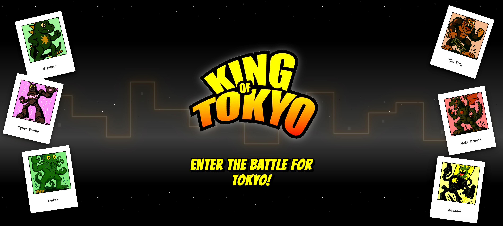
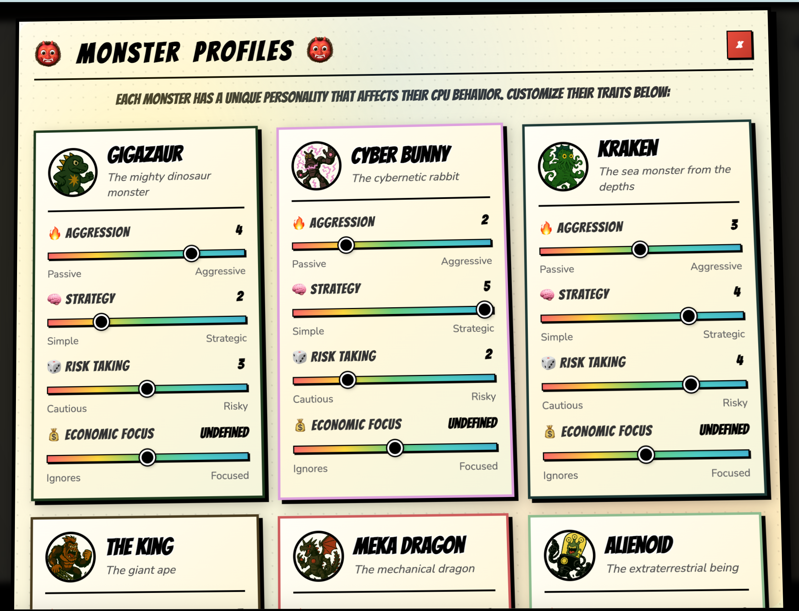
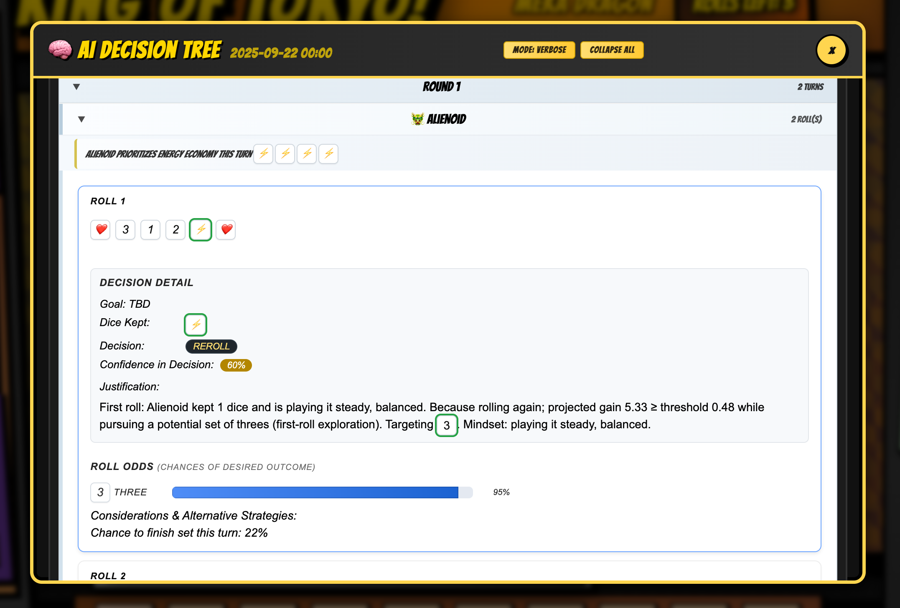
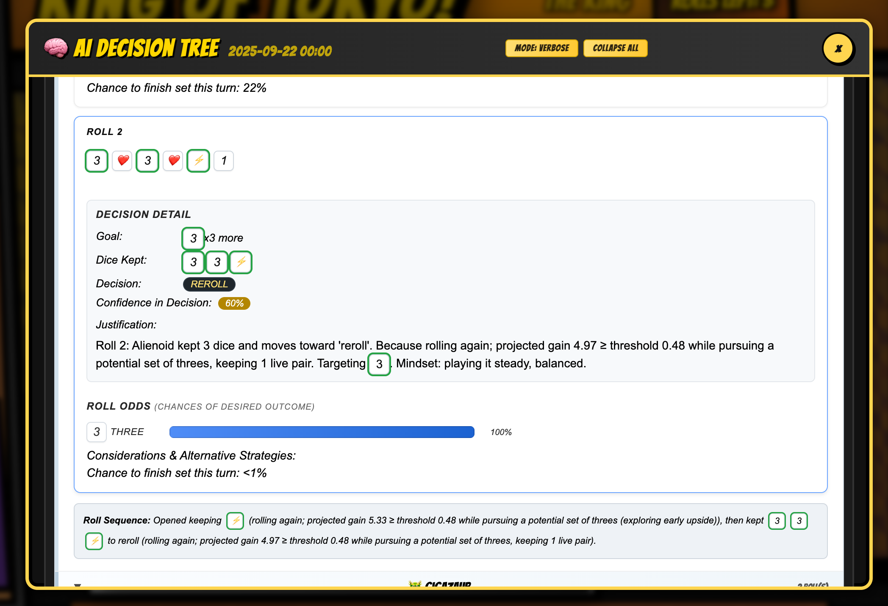

## Reconstructed Collaborati| Phase 3–4 | Modal & Monster UX parity | Card detail modal, owned cards modal, multi + single monster profile components | Complete |
| Phase 5 | Splash + design tokens (scaffold) | Splash dynamic polaroids, tokenization strategy (pending full extraction) | Partial |



| Terminology Refactor | "Player dashboard" → "Player profile card" | Dual-class strategy to preserve legacy symbolic CSS mapping | Complete |& Conversation History

Date of Reconstruction: 2025-09-24
Scope: This document reconstructs the missing conversational / collaboration history between the human developer and the AI assistant pertaining to the King of Tokyo project. It merges:
- Explicit written development artifacts (`DEVELOPMENT_LOG.md`, `DEVELOPMENT_SUMMARY.md`, `UI_PARITY_TODO.md`).
- Recent incremental rewrite activity under `new/` (Phases 6–8+ emerging).
- Assistant-authored architectural summaries (lost from session buffer) re-derived from code state and prior inline summaries.

> NOTE: This is a best-effort reconstruction. Exact wording of prior chat messages is not fully recoverable; instead, this captures intent, decisions, rationale, and sequencing for continuity.

---
## 1. Dual Track Reality: Legacy Implementation vs Incremental Rewrite

| Track | Location | Status | Purpose |
|-------|----------|--------|---------|
| Legacy / Classic Implementation | Root `js/`, `css/`, `index.html` | Mature, feature-complete (AI heuristics, full game loop, modals, CPU personality) | Production-quality baseline & reference |
| Incremental Rewrite (Modular Core) | `new/` | In-progress (Phases 6–8) | Clean architecture: reducers, services, effect engine, UI parity strategy |


The rewrite intentionally avoids editing legacy files, instead building a parallel system oriented around composable state management, testability, and future extensibility (effects queue, AI re-surface, parity diff tooling).

---
## 2. High-Level Phase Timeline (Rewrite Focus)

| Phase | Scope | Key Deliverables | Status |
|-------|-------|------------------|--------|
| Phase 1–2 | Core state slices + turn mechanics | Custom store, reducers (`players`, `dice`, `cards`, `tokyo`, `log`, `phase`, `meta`, `ui`), basic turn cycle & resolution stubs | Complete |
| Phase 3–4 | Modal & Monster UX parity | Card detail modal, owned cards modal, multi + single monster profile components | Complete |



| Phase 5 | Splash + design tokens (scaffold) | Splash dynamic polaroids, tokenization strategy (pending full extraction) | Partial |
| Terminology Refactor | “Player dashboard” → “Player profile card” | Dual-class strategy to preserve legacy symbolic CSS mapping | Complete |
| Phase 6 | Player Profile Card componentization | Single + manager (`player-profile-card(s)`), test harness, card lane placeholder | Complete |
| Phase 7 | Layout rails + draggable persistence | Drag service, localStorage hydration, reset event, applied to profile cards, dice tray, log feed; dev panel; audit tool | In progress (remaining: apply to second future component, grid/bounds exploitation) |
| Phase 8 (Scaffold) | Power Card Effect Engine | Effect queue slice, interpreter service, discard/keep integration, modifiers recalculation | Initial scaffold merged |
| Phase 8b (Passive Integration) | Player modifiers influencing dice | `diceSlots`, `rerollBonus` adoption in roll/ reroll start logic | Complete |
| Phase 9 (Planned) | UI queue visibility + targeted effects | Not started | Pending |
| Phase 10 (Legacy Track) | AI transparency & projection | Completed in legacy code (depth-2 projection, branch listing, accessibility uplift) | Done (legacy) |

---
## 3. Recent Concrete Changes (2025-09-23 → 2025-09-24)

### Effect Engine Introduction
- Added action types: `CARD_EFFECT_ENQUEUED`, `CARD_EFFECT_PROCESSING`, `CARD_EFFECT_FAILED`, reused `CARD_EFFECT_RESOLVED`.
- New reducer slice: `effectQueueReducer` with `queue`, `processing`, `history`.
- Service: `effectEngine` (handlers: `vp_gain`, `energy_gain`, `heal_all`, `dice_slot`, `reroll_bonus`).
- Purchase flow rewrite in `cardsService` to enqueue discard effects and optionally immediate keep effects.
- Exposed engine via `window.__KOT_NEW__.effectEngine` for dev / future UI.

### Passive Modifiers Integration
- Players now own `modifiers: { diceSlots, rerollBonus }` recalculated on card acquisition.
- Dice system modified: first roll of sequence derives `rerollsRemaining = baseRerolls + rerollBonus`.
- Turn service uses `diceSlots` for dynamic dice count.

### Dev Panel Enhancements
- New diagnostic buttons: log positions, dice state + active modifiers, effect queue state.

### Selectors & Testing
- Added queue selectors (`selectEffectQueueState`, etc.) for upcoming UI.
- Test harness `effectEngine.test.js` added (promise-based, not yet in unified test runner).

---
## 4. Rationale Behind Architectural Decisions

| Decision | Rationale | Trade-offs |
|----------|-----------|-----------|
| Custom minimal store (vs Redux) | Zero dependency footprint, pedagogical clarity | Less tooling/ecosystem, must hand-roll dev utilities |
| Effect queue slice (separate) | Enables auditing, future UI introspection, deferred / targeted resolution | Slight overhead vs inline immediate resolution |
| Passive modifier recalculation function (`recalcModifiers`) | Centralized derived state; keeps reducers pure | Must re-run scan on each card gain (acceptable scale) |
| Global dev exposure (`window.__KOT_NEW__`) | Rapid experiment & debug bridging old/new systems | Needs cleanup before production hardening |
| Card effect immediate enqueue vs inline resolution | Unifies effect resolution pathway | Adds microtask delay (insignificant currently) |

---
## 5. Known Gaps / Unimplemented Yet

1. Targeted / player-choice effects (need paused queue entries + UI prompt contract).
2. Persistent effect UI (panel or inline badge display) for both queue & passives.
3. Reroll augmentation display (UI label still assumes static 2 rerolls).
4. Dice capacity enforcement (prevent keeping more than allowed if capacity shrinks—future dynamic adjustments).
5. Formal automated test runner integration for new harnesses.
6. Visual regression & UI audit baseline automation (Phase P2 tasks still open in `UI_PARITY_TODO.md`).
7. Full token extraction (colors / spacing / typography tokens incomplete).
8. Accessibility audit on rewrite components (legacy partially addressed in Phase 10 work but not ported).

---
## 6. Reconstructed Intent Flow (Narrative Form)

1. Establish stable parallel rewrite environment → confirm isolation from legacy.
2. Introduce player presentation parity (profile cards) without redesigning layout.
3. Build layout rails & persist drag state to decouple absolute coordinates from DOM.
4. Add auditing tool to quantify visual parity pre-refactor.
5. Shift focus to systemic card effect interpretation (foundation for advanced AI & expansions).
6. Implement queue-based effect engine → route discard effects first (low-risk).
7. Layer passive modifier application (dice & rerolls) → surface immediate gameplay impact.
8. Prepare for next iteration: UI observability and interactive / targeted effects.

---
## 7. Mapping to Legacy AI Transparency Work

Recent legacy branch (Phase 10) introduced:
- Multi-branch EV simulation & depth-2 projection (reroll lookahead).
- Portfolio-aware energy valuation (shop synergy heuristic).
- Accessibility instrumentation (ARIA roles, focus trapping, live region announcements).





Rewrite track will eventually need:
- Mirroring of projection APIs (adapter to new state slices).
- Extracted AI service layered over the modular store.
- Reusable probability utilities (share or port from legacy heuristics code).

---
## 8. Suggested Persistence & Anti-Loss Mechanisms

| Mechanism | Description | Effort |
|-----------|-------------|--------|
| Session Snapshot Script | CLI script to compile state+open tasks → `docs/session-snapshots/<timestamp>.md` | Low |
| Automated Phase Tracker | Generate progress diff vs `UI_PARITY_TODO.md` on commit hook | Medium |
| Effect Queue Debug Panel | Small overlay listing queue/historical entries | Low |
| Test Harness Unification | Single runner enumerating `src/tests/*.test.js` with pass/fail summary | Low |
| Conversation Checkpoint File | Append incremental deltas to this file rather than overwriting | Low |

---
## 9. Recovery Confidence & Limitations

| Aspect | Confidence | Notes |
|--------|------------|-------|
| Phase ordering | High | Corroborated by code introduction order & prior summaries |
| Exact chat phrasing | Low | Reconstructed semantically only |
| Intent behind modifiers timing | High | Matches commit-level changes & effect engine integration timing |
| Unwritten future design decisions | N/A | Requires fresh planning |

---
## 10. Immediate Next Recommended Actions

1. Add minimal effect queue UI (list + statuses).  
2. Add `diceUi` label updates to reflect dynamic rerolls & dice slot count.  
3. Create `tests/modifiers.effect.spec.js` verifying Extra Head & Nitrous Oxide card purchases mutate dice system.  
4. Migrate at least one AI heuristic function into `new/` as exploratory adapter (e.g., dice tally scorer).  
5. Start token extraction (colors → `tokens.css`) to unlock wider Phase P1 closure.

---
## 11. How to Maintain This File

Append new deltas at bottom under a heading:
```
### Update YYYY-MM-DD
- Added ...
- Changed ...
- Open Risks ...
```
Avoid rewriting history; treat as append-only log to prevent future loss-of-context events.

---
## 12. Quick Reference – Current Rewrite Architecture Snapshot

```
store
  players: { order, byId[id]: { health, energy, victoryPoints, cards[], modifiers{diceSlots, rerollBonus}, ... } }
  dice: { faces[], rerollsRemaining, baseRerolls, phase }
  cards: { deck[], shop[], discard[] }
  effectQueue: { queue[], processing, history[] }
  tokyo: { occupantId }
  phase: 'SETUP' | 'ROLL' | 'RESOLVE' | 'BUY' | 'CLEANUP' | 'GAME_OVER'
  meta: { turn, activePlayerIndex }
  ui: { positions{}, splash, modals... }
```

---
## 13. Closing

This reconstruction should restore sufficient shared mental model to continue development without re-litigating prior decision context. If deeper granularity is needed (e.g., commit-by-commit semantic diff), a follow-up automation can be authored.

> Request: If further conversation context is lost later, seed the next recovery round by appending a delta section here before asking for reconstruction.

---
*End of reconstructed history.*
