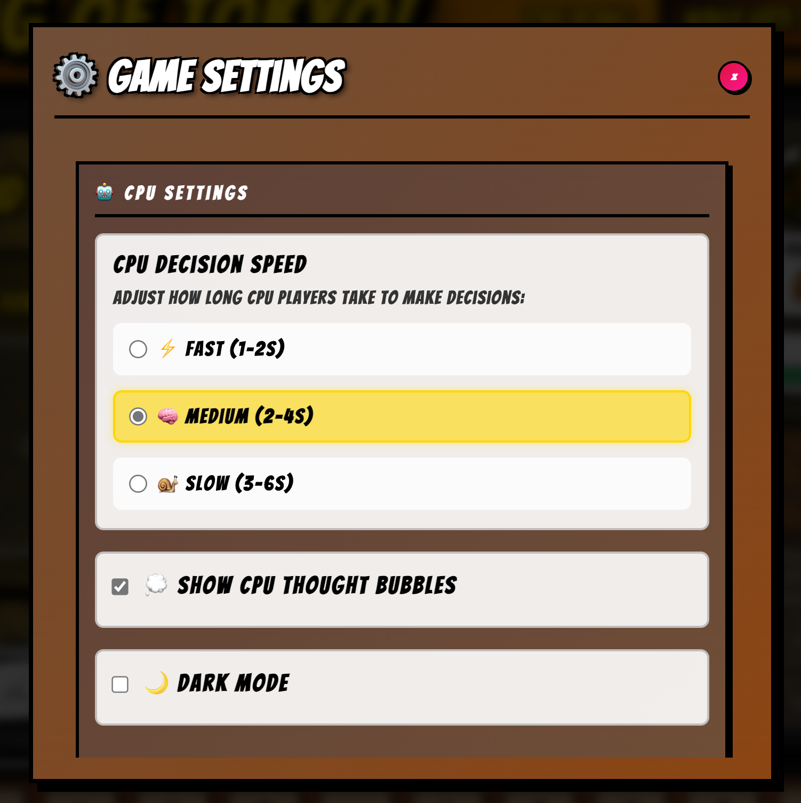
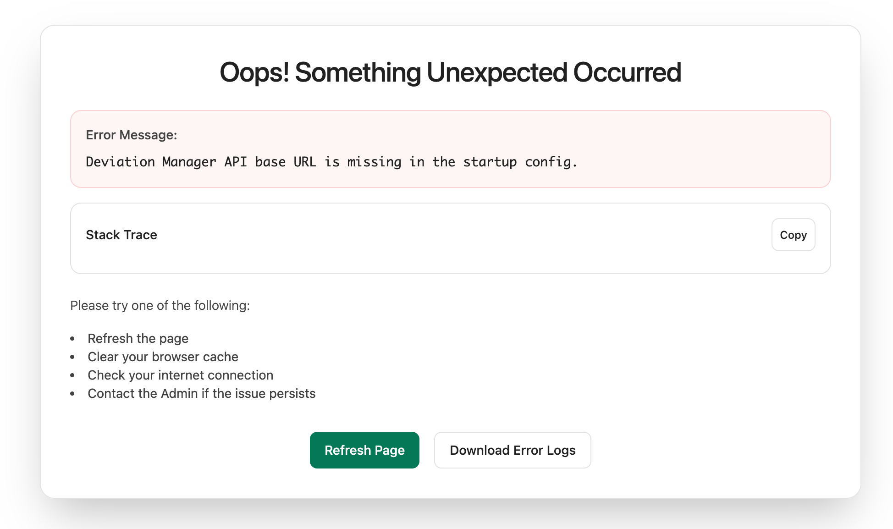
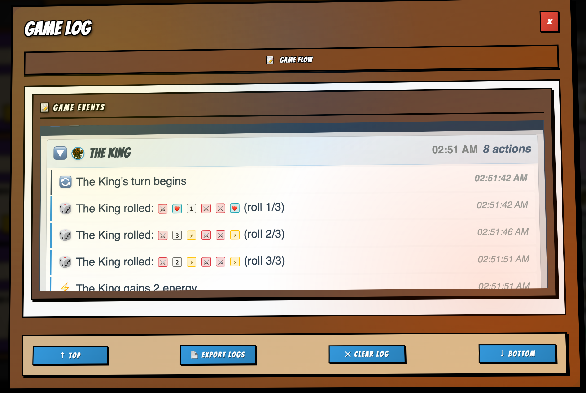
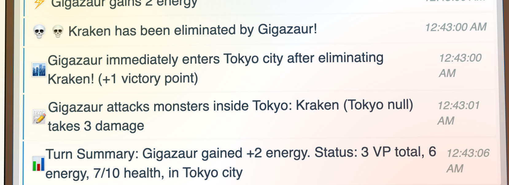
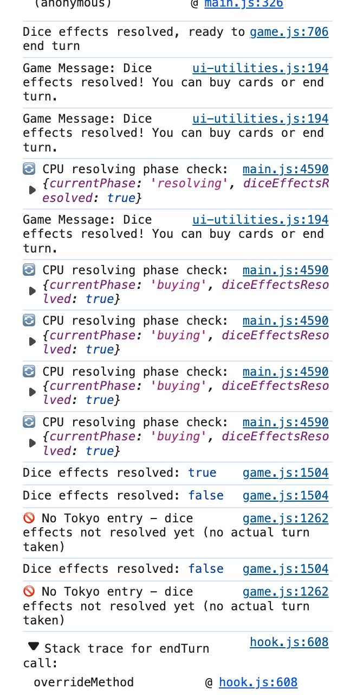
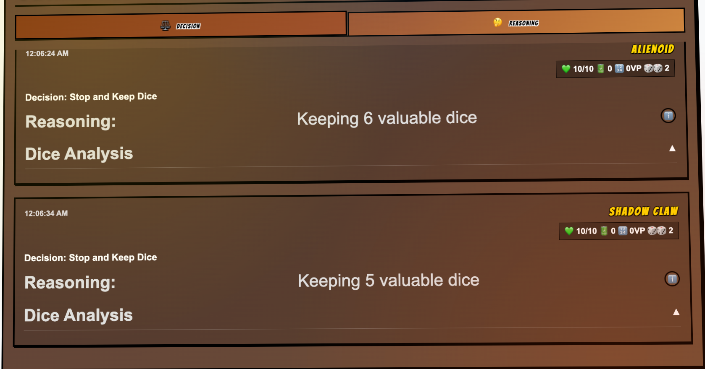

# Reconstructed Collaboration Timeline (Technical Focus)

> Scope: Purely implementation and UI/architecture collaboration threads. Excludes parity audi## 14. Accessibility & UX Timing Considerations (Initial Planning)
- Targeted: Focus management for modals (yield, card detail, settings).
- ARIA live region for phase announcements & takeover prompts (not yet live, reserved tokens in UI layer).
- CPU pacing normalization via min-phase guard plus optional `cpuSpeed` setting (slow/normal/fast) to emulate "thinking."

---
## 15. Logging Evolution & Hierarchical Game Log-discussion, executive email drafting, and managerial messaging. Intent is to reproduce the V2 game from scratch using these logged design & execution decisions.
>
> Guiding Principle: Deterministic, observable, incremental modernization of the King of Tokyo rules + UX while maintaining the ability to reason about and test AI behaviors.

---
## 0. Foundational Goals & Rationale
- Create a **modular rewrite (V2)** separating domain logic (dice, players, cards, effects) from UI concerns.
- Ensure **deterministic reproducibility** (seeded RNG, snapshotable state) to validate AI and rule sequencing.
- Replace ad hoc timing & state flags with a **finite phase/turn machine** (ROLL → RESOLVE → BUY → CLEANUP → NEXT TURN).
- Instrument **phase spans & transition telemetry** early to make pacing tunable without re-architecture.
- Unify divergent logic paths (human vs AI; legacy vs new) before layering complexity to avoid drift.

---
## 1. Early Modular Extraction
**Objective:** Remove dependency on legacy DOM & inline logic.
- Establish `store` + lightweight `eventBus` for dispatch and side-effect orchestration.
- Domain slices: `dice`, `players`, `phase`, `cards`, `tokyo`, later `effects`, `settings`, `ui.positions`.
- Rule: All new functionality enters through modular slices (no mutation via globals except controlled debug surface `window.__KOT_NEW__`).

**Key Decisions:**
- Dice state holds: array of dice (value, kept flag), `rerollsRemaining`, `sequencePhase` markers.
- Reroll loop encoded as decrementing `rerollsRemaining`; final roll triggers dice sequence completion event.
- Player slice tracks HP, VP, energy, elimination state.
- Tokyo slice: occupancy slots (City, Bay) + forced entry logic placeholder.

---
## 2. Dice Roll Flow & Finalization Event
**Problem:** Legacy relied on callbacks/polling for roll completion; rewrite required deterministic event.
**Solution:** Introduce `DICE_ROLL_RESOLVED` event to demarcate end-of-animation / acceptance.
- After final reroll (rerollsRemaining == 0), dice slice sets internal flag and dispatches the resolution event.
- Guards prevent double resolution (use `turnCycleId` concurrency token—see later phases).

**Implementation Notes:**
- Lock keep interactions while rolling; enable after event emission.
- Reroll bonuses & extra dice slots applied via modifiers (future effect integration path).

---
## 3. Phase Machine Scaffold
**Goal:** Replace scattered phase booleans with a linear, guardable state machine.
- Initial phases: `SETUP` → `ROLL` → `RESOLVE`.
- Auto-advance logic triggered on dice sequence complete.
- Log each transition with timestamp + source event for later parity analysis.

**Transition Validation:**
- Reject invalid transitions (telemetry counter increments). Keep soft-fail (log) rather than throwing early.
- Provide developer helper to observe transitions in console.

---
## 4. Logging & Observability Layer
**Why early:** Required to tune pacing & diagnose race conditions.
- Structured logger categories: `phase`, `dice`, `ai.decision`, `effect`, `shop`, `yield` (future), `system`.
- Retain last N entries (e.g., 50) in memory for lightweight UI feed.
- Uniform log shape: `{ timestamp, kind, phase, turn, round, details }`.

**Later Enhancements (planned, partially implemented):**
- Hierarchical round/turn expansion with collapsible UI.
- AI rationale linking (node IDs referencing decision tree states).

---
## 5. Card Engine Skeleton
**Objective:** Introduce purchasable power cards while deferring complex effect timing.
- Catalog loader builds deck -> shuffle -> fill shop (3 visible cards).
- Purchase flow: validate energy, transfer card to player, refill shop.
- Immediate vs Keep distinction stubbed (hooks for timed/delayed effects).

**Queued Effects Concept:**
- `effectQueue` introduced as scaffold: entries with type, target(s), pending resolution stage.
- Concurrency guard uses `turnCycleId` to ensure stale async operations (older turns) cannot resolve.

---
## 6. UI Component Baseline
**Components:** `diceTray`, `playerProfileCard(s)`, `logFeed`, `modals` container, card detail modal.
- Tokenization policy: new or touched styles must reference design tokens (colors, spacing, typography, elevations).
- Introduce `tokens.css` to centralize semantic variables.

**Position Persistence:**
- `ui.positions` slice: `componentName -> { x, y }`.
- Drag service with throttled store dispatch + localStorage hydration.
- Reset-all event (`ui/positions/resetRequested`).

---
## 7. Player Profile Cards & Multi-Instance Manager
**Features:**
- Dynamic rendering for each active player (HP, VP, Energy display + slot for owned cards preview lane).
- Data-binding via store subscription; minimal diff optimization (full re-render acceptable early).
- Integration with positioning rails for layout flexibility.

---
## 8. Effect & Modifier Integration (Initial)
**Modifiers:** `diceSlots`, `rerollBonus` applied to dice roll logic.
- Recompute modifiers from owned cards/effects on relevant state change.
- Placeholder for stacking & expiration semantics.

**Effect Queue:**
- Enqueue on purchase or trigger; resolution processing deferred (scaffold only initially).
- Designed to unify immediate/resolved ordering before complex card parity.

---
## 9. AI Decision Path (Dice Heuristic First Pass)
**Objective:** Provide baseline CPU behavior with deterministic replay capacity.
- Scoring heuristic evaluating: claws (attack potential), healing need, energy acquisition, VP triples potential.
- Generate hypothetical reroll projections for final roll rationale (placeholder factors list).
- Remove timer-based “auto-keep” path to eliminate double actuation race.

**Determinism:**
- Seed combination approach planned (e.g., `combineSeed('KOT_ROLL', turn, playerId)`), partial stubbing done.
- Future: yield + buy decisions reuse same deterministic seeding for test harness reproducibility.

---
## 10. Concurrency & Stale Async Guard
**Issue:** Potential for async timeouts or delayed effects to mutate state after the turn advanced.
**Solution:** Introduce `turnCycleId` incremented each new turn/phase sequence.
- All long-running or deferred operations capture current `turnCycleId` and verify match before committing changes.
- Log mismatch as stale-cancel telemetry (`stale.async.cancelled`).

---
## 11. Yield / Tokyo Takeover Unification (Backend Pipeline)
**Problem:** Legacy mix of heuristic immediate yield & timeouts created inconsistent takeover timing.
**Backend Plan:**
- Create batched yield prompt action: `YIELD_PROMPTS_CREATED` capturing defenders needing a decision.
- Terminal resolution: `YIELD_ALL_RESOLVED` gating takeover processing.
- Deterministic AI yield rationale seeded; human UI modal pending integration.

**Interim State:** Backend pipeline partially implemented (AI deterministic path / logging staged; UI incomplete).

---
## 12. Phase Span Instrumentation
**Purpose:** Quantify pacing & ensure min-phase durations.
- Capture: start timestamp, end timestamp, duration for each phase instance.
- Min-duration prototype for ROLL / RESOLVE / BUY controlling abrupt transitions.
- Telemetry: invalid transitions, phase duration histogram potential (future visualization overlay).

---
## 13. Rationale & Transparency Hooks (Planned / Partial)
**Hooks Added:**
- Placeholder data structure for AI roll decision factors.
- Intention to project effect queue impact into AI perception (virtual deltas for pending heal/damage/energy adjustments).
- Future labeling of decision node provenance: `source: heuristic | engine` and factor weight arrays.

---
## 14. Accessibility & UX Timing Considerations (Initial Planning)
- Targeted: Focus management for modals (yield, card detail, settings).
- ARIA live region for phase announcements & takeover prompts (not yet live, reserved tokens in UI layer).
- CPU pacing normalization via min-phase guard plus optional `cpuSpeed` setting (slow/normal/fast) to emulate “thinking.”

---
## 15. Logging Evolution & Hierarchical Game Log
**Enhancements (later stage):**
- Introduce round concept grouping turns.
- Collapsible UI nodes for round → turn → action cluster.
- Persist collapse state via localStorage to maintain session continuity.

---
## 16. Position & Layout Rails
**Abstraction:** Provide semantic rail containers (players rail, dice/action rail, log rail, modal staging layer).
- Decouple absolute positioning from component responsibilities.
- Export stable CSS hooks for future theming/dark edition overlay.

---
## 17. Dark Edition Hooks (Forward Compatibility)
- `meta.gameMode` placeholder to toggle alternate token set.
- Dark token override prepared; no logic divergence, purely styling path reserved.

---
## 18. Future Planned Enhancements (Snapshot)
| Category | Planned | Rationale |
|----------|---------|-----------|
| Yield Modal UI | Unified accessible modal + rationale summary | Complete interaction clarity & sequencing trust |
| Effect Processor | Operational queue w/ chained resolution & inspector | Support complex card stacks & delayed triggers |
| Persistence | Snapshot export/import of game state slices | Long-session continuity & test reproducibility |
| AI Strategy | Multi-roll EV + survival risk + personality weights | Depth & differentiation between CPU players |
| Rationale Overlay | Factor breakdown panel & seed provenance | Responsible AI transparency & debugging |
| Timing Overlay | Dev-only phase span histogram + variance | Pacing tuning & regression detection |
| Accessibility Sweep | Landmarks, aria-live, focus traps | Inclusive design & compliance foundation |

---
## 19. Reproduction Checklist (From Scratch)
1. Initialize store + event bus; define core slices (players, dice, phase, tokyo, cards).
2. Implement dice reroll logic with `rerollsRemaining` and final resolution dispatch.
3. Add logging system (structured kinds) + transition logging.
4. Create phase machine with validation & auto-advance on final roll.
5. Build basic UI components (dice tray, player cards, log feed) wired to store.
6. Seed card catalog + shop; implement purchase & deck refill.
7. Introduce `effectQueue` scaffold (no complex resolution yet).
8. Add AI heuristic for keep decisions; unify actuation path (remove redundant timer path).
9. Add concurrency guard via `turnCycleId` for async safety.
10. Instrument phase spans & min-duration gating prototype.
11. Implement backend yield pipeline (batched prompts, deterministic AI) – UI pending.
12. Persist UI component positions (drag → store → localStorage hydration).
13. Add modifiers (diceSlots, rerollBonus) recalculated on relevant state changes.
14. Introduce hierarchical log (round/turn) + collapse persistence.
15. Prepare Dark Edition tokens (no logic change) and meta mode switch.
16. Expand AI rationale placeholder structures (factors, seeds, node provenance).
17. Execute accessibility pass (focus traps, live regions, role semantics).
18. Add persistence (snapshot export/import) and deterministic harness tests.
19. Implement effect processor + inspector; support delayed triggers & stacked modifier timing.
20. Finalize yield modal UI + takeover animation & accessibility.

---
## 20. Architectural Guardrails (Must Preserve)
- Single authoritative transition path: no direct phase mutation outside transition helper.
- No side-effects in reducers; orchestration lives in services / handlers tied to event bus.
- All async operations capture `turnCycleId` and verify before committing.
- Logging never throws; failures degrade silently with diagnostic warning.
- Tokens-first styling for any new component or refactor.
- Deterministic seeding surfaces centralized (easy to reset & audit).

---
## 21. Risk Mitigation Patterns
| Risk | Mitigation | Status |
|------|------------|--------|
| Double actuation (AI + timeout) | Unified AI decision path, removed timer auto-keep | ✅ Implemented |
| Stale async mutation | `turnCycleId` guard & stale cancel telemetry | 🟡 Coverage expanding |
| Inconsistent yield ordering | Batched prompt pipeline (UI pending) | 🟡 Backend implemented |
| Timing whiplash | Min phase duration gating | 🧪 Prototype |
| Unexplainable AI choices | Rationale placeholders & seed plan | 🟡 Partial |
| Style drift | Token enforcements & audit harness | 🟡 Early |
| Effect complexity explosion | Queue scaffold abstraction | 🧪 Scaffold |

---
## 22. Pending Data Model Extensions
- Effect entry schema: `{ id, type, targets, timing, applyFnRef, createdTurn, dependencies }`.
- Rationale node schema (planned): `{ id, source, factors: [{name, weight, contribution}], seed, decisionType }`.
- Snapshot manifest: `{ players, dice, cards: { deck, shop }, effects, tokyo, phase, meta, settings }`.

---
## 23. Suggested Testing Strategy (High-Level)
| Test Type | Focus | Example |
|-----------|-------|---------|
| Unit | Dice rolling, reroll limits, modifiers | Ensure rerollBonus increments capacity correctly |
| Integration | Phase transitions + logging | Final roll triggers RESOLVE only once |
| Deterministic Harness | AI decision repeatability | Same kept dice set for fixed seed over N runs |
| Effect Queue | Ordering & guard | Stale effect (old turnCycleId) ignored |
| UI Interaction | Drag persistence | Position restored after reload |
| Performance (Dev) | Phase span variance | σ/μ threshold < target |

---
## 24. Implementation Ethos
- Ship instrumentation with the feature, not after.
- Collapse divergent logic *before* introducing AI complexity.
- Keep early scaffolds minimal but semantically named for forward clarity.
- Treat human–AI dialog (prompts + rationale evolution) as a reusable asset micro-library.

---
## 25. Immediate Next Action Candidates
- Promote deterministic seed utility to shared module & apply to yield flow.
- Implement first visible yield decision modal (basic accessible skeleton) hooking resolved backend pipeline.
- Expand effect queue with one concrete delayed effect to validate processing path.
- Add initial rationale panel reading placeholder factor data (even if weights static initially).

---
## 26. Glossary (Rewrite Context)
| Term | Meaning |
|------|---------|
| turnCycleId | Monotonic guard string/number for async validity per turn/phase sequence |
| Phase Span | Duration metric from phase entry to exit for pacing analytics |
| Batched Yield | Aggregated set of defenders requiring yield decision resolved collectively before takeover |
| Deterministic Mode | Execution harness where RNG and AI decisions are seeded & reproducible |
| Rationale Factors | AI decision contributing signals (weights later) |
| Effect Queue | Deferred or ordered resolution list for card effects |

---
**End of Reconstruction v002**
