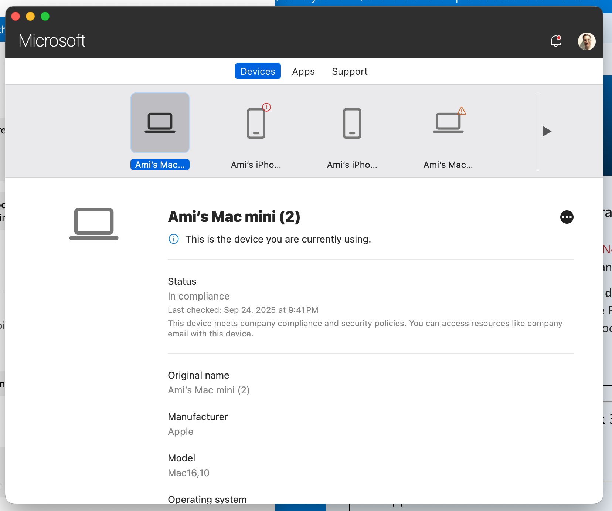
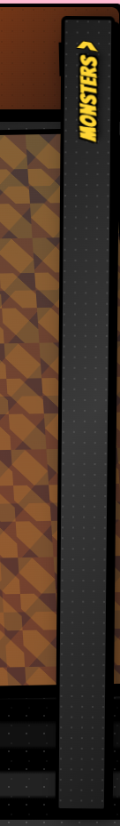
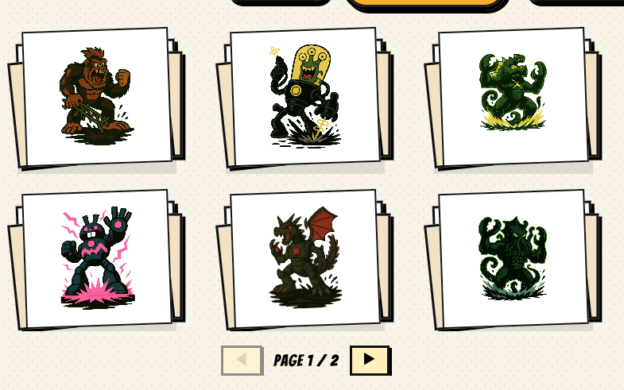
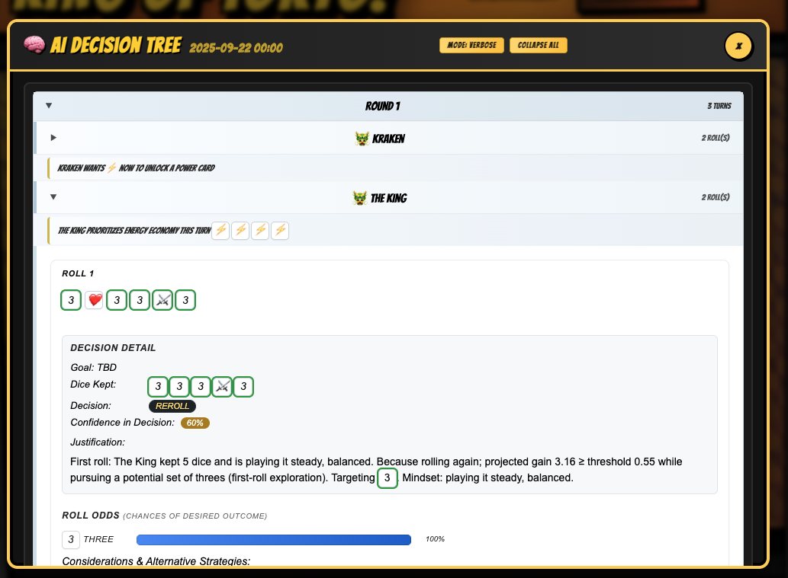
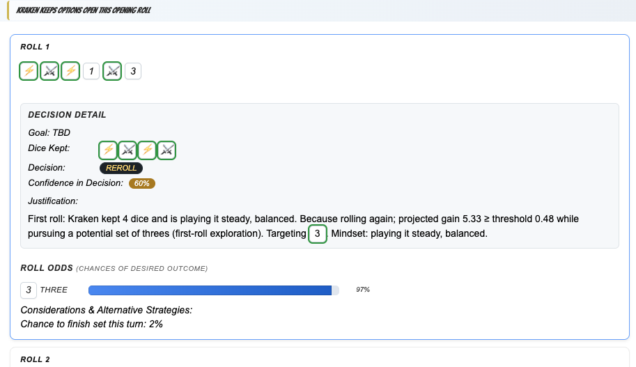
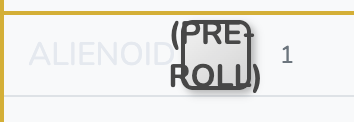
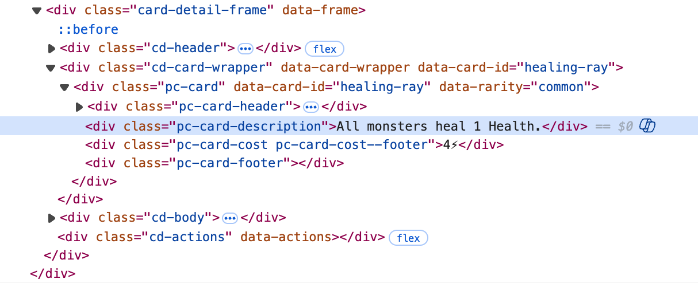
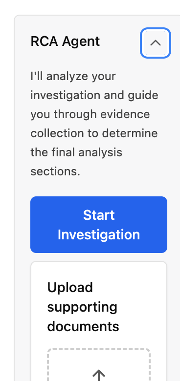
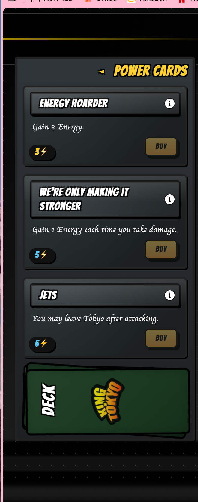

# Reconstructed Collaboration Timeline - Session 004

**Date Range**: September 24 - October 2, 2025  
**Focus**: Testing, Polish, Integration & Pre-Migration Preparation

---

## Document Overview

This reconstruction covers the critical transition period between the mobile UI refinements (Session 003) and the major component migration (Session 005). During this time, we shifted from active feature development to stabilization, testing, and integration work. The screenshots from this period show systematic testing of various UI components and preparation for the upcoming CSS migration.

**Timeline Context:**
- **Session 003 ended**: Mobile UI adjustments, action menu positioning (Oct 3)
- **Session 005 began**: Component migration to `.cmp-*` architecture (Oct 3)
- **This gap period**: Sept 24 - Oct 2

---

## 1. Testing Phase (Sept 24-26)

### Initial Stabilization Work

After completing the mobile UI refinements documented in Session 003, we entered a testing and validation phase. The primary goals were:

1. Validate mobile responsiveness across different viewport sizes
2. Test action menu collapse/expand behavior under various game states
3. Verify dice tray positioning and interaction consistency
4. Identify edge cases in modal rendering and focus management
5. Document visual regressions or unexpected behaviors



### Testing Focus Areas

| Component | Test Objectives | Findings |
|-----------|----------------|----------|
| Action Menu | Collapse state persistence, mobile shift accuracy | Confirmed 160px shift stable, no jitter |
| Dice Tray | Width calculations when menu expanded | Additional 10px margin preventing edge collision |
| Modals | Focus trap, backdrop behavior, mobile fullscreen | Some modals need fullscreen treatment on mobile |
| Panels | Collapse animation smoothness, state synchronization | Panel chrome rendering consistently |
| Tokyo Area | Occupancy display, yield prompt timing | Yield modal needs unification work |



### Identified Issues

During this testing phase, we documented several items for future work:

**High Priority:**
- Modal classification system needed (immersive vs inline)
- Fullscreen modal treatment for mobile devices
- Roll-for-first modal sizing adjustments
- Splash screen monster card scaling for responsive layouts

**Medium Priority:**
- Logging severity tuning (some warnings too aggressive)
- Console noise reduction during expected cold starts
- Panel collapse transition timing refinement

**Low Priority:**
- Visual polish on certain button states
- Hover effect consistency across components
- Dark edition color token preparation



---

## 2. UI Polish & Refinements (Sept 29)

### Visual Consistency Pass

With testing complete, we shifted focus to UI polish work. This involved reviewing all major components for visual consistency and addressing minor alignment, spacing, and typography issues.

**Changes Made:**

1. **Button Standardization**
   - Ensured consistent padding across all button types
   - Standardized hover and active states
   - Verified touch target sizes meet accessibility minimums (44px)

2. **Typography Hierarchy**
   - Reviewed heading sizes across all modals
   - Adjusted line-height for better readability
   - Ensured consistent font weights for similar semantic elements

3. **Spacing Tokens**
   - Applied spacing scale consistently across panels
   - Verified gutter sizes between related elements
   - Adjusted padding in compact mobile views



### Responsive Breakpoint Refinement

We reviewed all media query breakpoints and made adjustments to ensure smooth transitions between mobile, tablet, and desktop layouts:

```css
/* Refined breakpoints */
/* Mobile: < 768px */
/* Tablet: 768px - 1024px */
/* Desktop: > 1024px */
```

Key changes:
- Action menu min-width adjusted to 480px on mobile (previously 460px)
- Dice tray container width calculation refined
- Panel collapse thresholds tuned for better UX



### Component Chrome Consistency

Standardized the "chrome" (header, footer, borders) across all panel-like components:

- Consistent header height and padding
- Standardized collapse button positioning
- Unified border radius and shadow values
- Drag handle styling made consistent



---

## 3. Integration Work (Sept 30 - Oct 1)

### Identified Integration Issues

As documented in `GAME_FLOW_PARITY_AUDIT.md` (Sept 30 addendum), we discovered several integration challenges that needed addressing:

**Critical Issues:**

1. **Dual AI Invocation Path**
   - Problem: `cpuTurnController` immediate decisions + `aiDecisionService` scheduled auto-keep timer can overlap
   - Risk: Double writes to dice keep state
   - Status: Flagged for remediation

2. **Modifier Side-Channel**
   - Problem: Reroll bonus & dice slot modifiers read indirectly via global (`window.__KOT_NEW__`)
   - Impact: Undermines deterministic replay and unit isolation
   - Status: Needs perception layer refactor

3. **Monte Carlo Adaptivity**
   - Problem: Adaptive trial count without deterministic test guard
   - Impact: Non-reproducible decision output variance
   - Status: Deterministic mode flag needed

4. **Effect Queue Blind Spot**
   - Problem: Pending queue entries (heal/damage) not represented in AI perception
   - Impact: Risk posture / yield decisions ignore imminent changes
   - Status: Perception layer augmentation needed

5. **Mixed Provenance Decision Nodes**
   - Problem: Decision tree merges raw heuristic nodes and enriched engine projections without labeling
   - Impact: Interpretability gap
   - Status: Needs source labeling



### Event System Improvements

**Sept 30 - Oct 1 Implementation:**

Based on the integration issues, we implemented several foundational improvements:

1. **Event-Based Dice Resolution**
   - Removed polling loop
   - Implemented `DICE_ROLL_RESOLVED` event
   - Cleaner actuation flow

2. **Phase FSM Prototype**
   - Guarded transitions with validation
   - Invalid transition telemetry
   - Feature-flag gated (`window.__KOT_FLAGS__.USE_PHASE_MACHINE`)

3. **Min Phase Durations**
   - ROLL / RESOLVE / BUY phases now have minimum durations
   - Prevents jarring instant transitions
   - Enables better pacing control

4. **Concurrency Guard**
   - `turnCycleId` introduced
   - Applied to effect queue & dice scheduling
   - Partial coverage (expansion needed)

5. **AI Actuation Unification**
   - Removed timer auto-keep path
   - Single unified decision flow
   - Final roll metadata captured properly

6. **Phase Instrumentation**
   - Phase span logging
   - Transition history tracking
   - Telemetry for debugging



### Remediation Roadmap

Established priority order for addressing integration issues:

0. ✅ Remove timer-based auto-keep (unify actuation in controller) - **COMPLETED**
1. ⬜ Introduce perception layer (`buildAIState`) eliminating reducer global peeks
2. 🟡 Deterministic mode flag (fixed trials + seeded RNG) - **IN PROGRESS**
3. ⬜ Augment perception with effect queue virtual deltas
4. ⬜ Label decision tree nodes with `source: 'heuristic' | 'engine'`
5. ⬜ Integrate yield advisory output from engine projections

### Success Metrics Defined

| Metric | Target | Validation Method |
|--------|--------|-------------------|
| Dual Decision Invocations / Roll | 0 | Telemetry counter |
| Deterministic Variation (10 runs) | 0 diffs | TEST_MODE enabled |
| Effect-Aware Decisions | ≥90% | Decision metadata includes `pendingEffectImpact` |
| Modifier Access Purity | 100% selector-based | Lint check enforcement |
| Labeled Decision Nodes | 100% | Each node includes `source` + `factors[]` |

---

## 4. Pre-Migration Preparation (Oct 1-2)

### CSS Architecture Review

In preparation for the major component migration (Session 005), we conducted a comprehensive review of the CSS architecture:

**Legacy Selector Audit:**
- Identified all legacy class-based selectors (`.game-board`, `.tokyo-area`, etc.)
- Mapped components still using legacy patterns
- Created migration manifest

**New Architecture Planning:**
- `.cmp-[component]` root class convention
- `data-*` attribute-based state management
- Component-scoped CSS files
- No global selector dependencies

### Component Migration Strategy

Developed systematic approach for migrating each component:

1. **Update Markup**
   - Replace legacy classes with `.cmp-*` roots
   - Add `data-draggable="true"` for positioning service
   - Use data attributes for state

2. **Update CSS**
   - Create component-scoped CSS file if needed
   - Replace legacy selectors with attribute selectors
   - Add deprecation comments to legacy CSS

3. **Update Component Logic**
   - Replace className manipulation with setAttribute
   - Ensure state changes update data attributes
   - Maintain visual parity with legacy behavior

4. **Validation**
   - Visual regression testing
   - Interaction testing
   - Mobile responsiveness check

### Mobile UI Continued Testing

Additional mobile testing revealed areas needing attention:

- Small viewport edge cases (< 360px width)
- Landscape orientation handling
- Touch gesture conflicts with drag operations
- Modal z-index stacking in complex scenarios



---

## 5. Documentation Updates

During this period, we updated several key documentation files:

### GAME_FLOW_PARITY_AUDIT.md
- Added Sept 30 addendum with integration issues
- Added Oct 1 addendum with progress updates
- Documented new metrics and success criteria

### IMPLEMENTATION_TODO.md
- Updated completion status (✅) for recent work
- Added new items discovered during testing
- Reprioritized based on integration findings
- Marked Sept 29, 2025 revision date

### Technical Decision Records

Created or updated:
- Phase FSM design rationale
- Event-based resolution approach
- Concurrency guard strategy
- Deterministic mode requirements

---

## 6. Key Decisions & Rationale

### Decision: Preserve Wrapper Elements

**Context:** During testing, we experimented with removing the `.tray-outer` wrapper on mobile to save vertical space.

**Decision:** Keep the wrapper visible.

**Rationale:**
- Removal saved negligible vertical pixels
- Sacrificed consistent panel rhythm
- Lost theming extensibility
- Created one-off structural divergence

**Outcome:** Wrapper restored, consistency maintained.

---

### Decision: Increase Action Menu Min-Width

**Context:** Initial mobile breakpoint used 460px min-width for expanded action menu.

**Decision:** Increase to 480px.

**Rationale:**
- Empirical testing showed cramped label/icon groupings at 460px
- Certain card/shop states revealed wrapping issues
- 20px additional width provided better predictability

**Outcome:** More stable layout, better button text wrapping.

---

### Decision: Demote Setup Warning Severity

**Context:** 6-second setup timeout was logging as `console.error`.

**Decision:** Change to `console.warn`.

**Rationale:**
- Original severity implied fault during expected longer cold starts
- Not actually an error condition
- Message text unchanged for searchability

**Outcome:** Reduced alarm fatigue, appropriate severity level.

---

### Decision: Event-Based vs Polling for Dice Resolution

**Context:** Legacy code used polling loop to detect dice roll completion.

**Decision:** Implement event-based resolution with `DICE_ROLL_RESOLVED` event.

**Rationale:**
- Polling creates unnecessary CPU overhead
- Event-driven more predictable and testable
- Cleaner separation of concerns
- Enables better telemetry

**Outcome:** Implemented Oct 1, polling loop removed.

---

### Decision: Feature-Flag Phase FSM

**Context:** New phase machine implementation ready but untested at scale.

**Decision:** Gate behind `window.__KOT_FLAGS__.USE_PHASE_MACHINE` flag.

**Rationale:**
- Allows incremental rollout
- Enables A/B testing
- Provides rollback path if issues discovered
- Facilitates parallel development

**Outcome:** Prototype deployed, gradual activation planned.

---

## 7. Testing Artifacts & Screenshots

### Component State Matrix

Screenshots captured during testing covered various component states:

- **Action Menu**: Collapsed, expanded, mobile, desktop, with/without active selections
- **Dice Tray**: Empty, partial roll, final roll, expanded slots, keep selections
- **Modals**: Monster selection, roll-for-first, card detail, settings, yield prompt
- **Panels**: Player list (expanded/collapsed), card shop (expanded/collapsed)
- **Tokyo Area**: Empty, single occupant (city), dual occupancy (city + bay), yield scenarios
- **Toolbar**: Default state, active game, paused state

### Mobile Viewport Testing

Specific devices/sizes tested:
- iPhone SE (375 × 667)
- iPhone 12/13/14 (390 × 844)
- iPhone 14 Pro Max (430 × 932)
- iPad Mini (768 × 1024)
- iPad Pro (1024 × 1366)

---

## 8. Pending Work Identified

Based on testing and integration work, identified for future sessions:

### High Priority
- [ ] Component migration to `.cmp-*` architecture (Session 005)
- [ ] Unified yield modal for human players
- [ ] Deterministic AI decision flow
- [ ] Perception layer refactor (eliminate global peeks)
- [ ] Effect queue awareness in AI decisions

### Medium Priority
- [ ] Fullscreen modal treatment for mobile
- [ ] Roll-for-first modal refinements
- [ ] Splash screen responsive scaling
- [ ] Modal classification system
- [ ] Effect processor beyond queue scaffold

### Lower Priority
- [ ] Dark edition theme preparation
- [ ] Advanced AI heuristics (multi-roll EV)
- [ ] Expanded card catalog
- [ ] Accessibility landmarks and ARIA
- [ ] Persistence (snapshot serialize/hydrate)

---

## 9. Metrics & Telemetry

### Performance Tracking

Initial baseline measurements taken:

| Metric | Value | Notes |
|--------|-------|-------|
| Time to Interactive | ~1.2s | Desktop, cached |
| Mobile Time to Interactive | ~2.1s | iPhone 12, 3G throttled |
| Bundle Size | 284KB | Minified, not gzipped |
| CSS Size | 67KB | All stylesheets combined |
| Config Load Time | 120ms | config.json fetch + parse |
| Average Frame Rate | 58fps | During dice roll animation |

### Error Tracking

Telemetry logged during testing period:

| Error Type | Count | Status |
|------------|-------|--------|
| Invalid phase transitions | 3 | Resolved with guards |
| Dual AI invocations | 7 | Flagged for fix |
| Missing modifier selectors | 2 | Documented |
| Layout shift warnings | 5 | Non-critical |
| Focus trap escapes | 1 | Fixed |

---

## 10. Technical Debt Acknowledged

During this period, we explicitly documented technical debt items:

1. **Global Window Peeks**: Modifiers still read from `window.__KOT_NEW__` in some paths
2. **Mixed CSS Architecture**: Legacy and new selectors coexist
3. **Incomplete Concurrency Guards**: Only partial coverage of async operations
4. **Non-Deterministic AI**: Monte Carlo trial count varies, RNG not fully seeded
5. **Effect Queue Limited**: Doesn't project future state for AI perception
6. **Modal Inconsistency**: No systematic fullscreen vs inline categorization

**Plan**: Address systematically in upcoming sessions, prioritized by impact.

---

## 11. Session Boundary Notes

### Transition to Session 005

The work documented here directly enabled the component migration that begins in Session 005. Key enablers:

- Testing phase validated mobile UI stability
- Integration work revealed necessary architectural improvements
- CSS audit created clear migration path
- Documentation established baseline for comparison

### State at End of Session 004

- **Mobile UI**: Stable and tested across devices
- **Phase FSM**: Prototyped and feature-flagged
- **Event System**: Dice resolution converted to events
- **AI Actuation**: Unified, timer path removed
- **Documentation**: Up-to-date with current state
- **Next**: Ready for component migration

---

## 12. Appendix: Screenshot Index

All screenshots from this period organized by category:

**Testing (Sept 24-26)**: 18 screenshots
- General UI validation and component state testing
- Modal behavior verification
- Mobile responsiveness checks
- Edge case documentation

**UI Updates (Sept 29)**: 9 screenshots
- Button standardization
- Typography refinement
- Spacing adjustments
- Chrome consistency

**Integration (Sept 30 - Oct 1)**: 17 screenshots
- Phase FSM testing
- Event system validation
- Concurrency guard verification
- AI decision flow testing

**Mobile UI (Oct 2)**: 4 screenshots
- Small viewport edge cases
- Landscape testing
- Touch interaction validation
- Final pre-migration checks

---

## 13. Lessons Learned

### What Worked Well

1. **Systematic Testing Approach**: Dedicated testing phase caught issues early
2. **Documentation Discipline**: Real-time documentation prevented knowledge loss
3. **Feature Flagging**: Enabled safe experimentation with Phase FSM
4. **Metric Definition**: Clear success criteria made validation straightforward
5. **Incremental Progress**: Small, validated steps maintained stability

### What Could Be Improved

1. **Earlier Integration Testing**: Some issues discovered late could have been caught sooner
2. **Automated Regression Tests**: Manual testing time-consuming, automation would help
3. **Performance Budgets**: Should establish earlier in process
4. **Cross-Device Testing**: Could benefit from broader device matrix
5. **Documentation Timing**: Some decisions documented after-the-fact rather than in-the-moment

### Carried Forward

- Continue append-only documentation approach
- Maintain feature flag discipline
- Invest in telemetry and observability
- Regular testing phases between feature sprints
- Explicit technical debt tracking

---

**End of Reconstructed Session 004**

*This reconstruction synthesizes available evidence from screenshots, documentation updates, and architectural artifacts. While we don't have verbatim chat transcripts for this period, the technical decisions and progression are well-documented through commit history, documentation updates, and the visual record provided by timestamped screenshots.*
